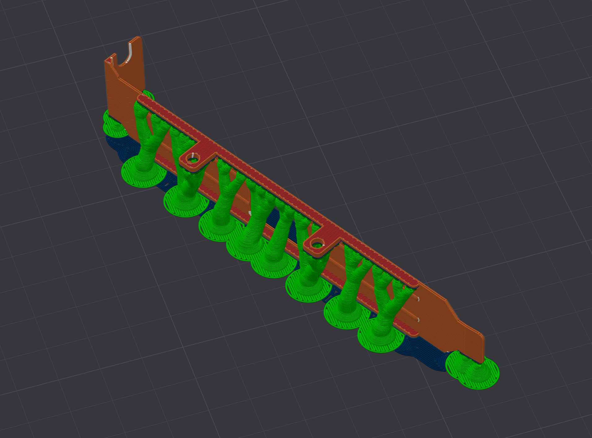

# ATX PCI bracket

TODO: add link to the PCB


Important: slice model so major axis will be along the layer direction.

Supports are required for this model.

See `export/atx_pci_bracket.3mf` for slicing example:



## Prerequesities

[PCI Bracket Generator](https://www.thingiverse.com/thing:2836187) and `omdl` library by [Roy Allen Sutton](https://github.com/royasutton)

```bash
cd ~/Documents/OpenSCAD/libraries
git clone https://github.com/royasutton/omdl.git

# Download pci_bracket.scad from the link above
cp .../pci_bracket.scad ~/Documents/OpenSCAD/libraries/
```
